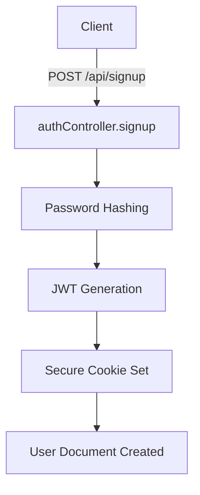
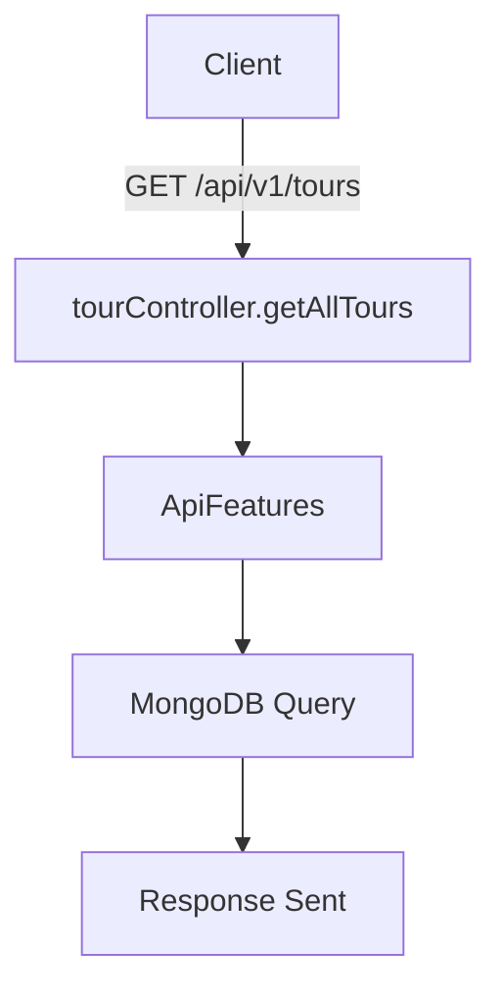

<!-- eslint-disable rule-name -->

# Technical Analysis of Node.js Backend

## Authentication Analysis

### Signup Phase

**Conceptual Overview:**
The signup phase is responsible for creating a new user in the system. It involves validating user input, securely storing passwords, and generating a JSON Web Token (JWT) for authentication. Passwords are hashed using bcrypt before being saved to the database, ensuring they are not stored in plain text. A secure cookie is set to store the JWT, enabling the client to authenticate subsequent requests.

**Step-by-Step Flow:**

1. Client → POST `/api/signup` → `authController.signup`
2. Password hashing → `userModel.pre('save')`
3. JWT generation → `signToken` function
4. Secure cookie set → `res.cookie('jwt', token, options)`
5. User document created → `User.create(req.body)`

**Key Security Considerations:**

- Ensure passwords are hashed with a strong algorithm (e.g., bcrypt).
- Use `httpOnly` and `secure` flags for cookies to prevent XSS attacks.
- Validate user input to prevent injection attacks.

**Optimization Opportunities:**

- Use rate limiting to prevent brute force attacks on the signup endpoint.
- Implement email verification to ensure valid user accounts.

### Login Phase

**Conceptual Overview:**
The login phase authenticates users by validating their credentials and issuing a new JWT. The system compares the provided password with the hashed password stored in the database. Upon successful authentication, a new JWT is generated and sent to the client in a secure cookie.

**Step-by-Step Flow:**

1. Client → POST `/api/login` → `authController.login`
2. Credentials validation → `User.findOne({ email }).select('+password')`
3. Password comparison → `user.correctPassword`
4. Token refresh → `signToken(user._id)`
5. Cookie renewal → `res.cookie('jwt', token, options)`

**Key Security Considerations:**

- Lock accounts after multiple failed login attempts.
- Use short-lived JWTs and implement refresh tokens for extended sessions.
- Ensure cookies are sent over HTTPS.

**Optimization Opportunities:**

- Cache user sessions to reduce database lookups.
- Use a Content Delivery Network (CDN) to serve static assets for faster login page loading.

### Protection Middleware

**Conceptual Overview:**
The protection middleware ensures that only authenticated users can access protected routes. It extracts the JWT from the request, verifies its validity, and checks if the user still exists and has not changed their password since the token was issued.

**Step-by-Step Flow:**

1. Request interception → `authController.protect`
2. JWT extraction → `req.headers.authorization.split(' ')[1]`
3. Token verification → `JWT.verify`
4. User lookup → `User.findById(decoded.id)`
5. Password change check → `user.changedPasswordAfter(decoded.iat)`
6. Access grant → `next()`

**Key Security Considerations:**

- Use strong secrets for signing JWTs.
- Implement token expiration and revocation mechanisms.
- Log unauthorized access attempts for auditing.

**Optimization Opportunities:**

- Use in-memory token validation for faster checks.
- Implement role-based access control (RBAC) for fine-grained permissions.

## Mongoose Deep Dive

### Schema Design

**Conceptual Overview:**
Schemas define the structure of documents in MongoDB. Relationships between collections (e.g., tours and users) are modeled using references or embedded documents. Validation rules ensure data integrity and consistency.

**Key Features:**

- Relationships: Users can book multiple tours, and tours can have multiple guides.
- Validation: Enforce required fields, data types, and custom rules (e.g., priceDiscount < price).

**Optimization Opportunities:**

- Use indexes for frequently queried fields (e.g., `price`, `ratingsAverage`).
- Denormalize data where appropriate to reduce lookup times.

### Hooks

**Conceptual Overview:**
Mongoose hooks (middleware) allow you to execute logic before or after certain operations. Pre-save hooks are used for data normalization (e.g., hashing passwords), while post-save hooks handle async operations (e.g., sending emails).

**Examples:**

- Pre-save: `userSchema.pre('save', ...)`
- Post-save: `tourSchema.post('save', ...)`

**Optimization Opportunities:**

- Minimize async operations in hooks to reduce latency.
- Use queues for background tasks triggered by hooks.

### Custom Methods

**Conceptual Overview:**
Custom methods add reusable logic to Mongoose models. For example, password comparison and token timestamp validation are implemented as instance methods on the user schema.

**Examples:**

- `user.correctPassword(candidatePassword, userPassword)`
- `user.changedPasswordAfter(JWTTimestamp)`

**Optimization Opportunities:**

- Cache frequently used methods for better performance.
- Use static methods for operations that don’t depend on a specific document.

## Request Lifecycle

### Middleware Stack

**Conceptual Overview:**
Middleware functions process requests in a sequential manner. The stack includes rate limiting, body parsing, security headers, and route handlers.

**Flow:**

1. Rate limiting → `express-rate-limit`
2. Body parsing → `express.json()`
3. Security headers → `helmet()`
4. Route handlers → `app.use('/api/v1/tours', tourRouter)`

**Optimization Opportunities:**

- Use compression middleware to reduce response sizes.
- Optimize middleware order to minimize processing time.

### Error Handling Path

**Conceptual Overview:**
Errors are propagated through the middleware stack to a centralized error handler. The `AppError` class standardizes error objects, and the `globalErrorHandler` formats responses for the client.

**Flow:**

1. Controller → `next(new AppError(...))`
2. AppError → Custom error class
3. ErrorController → Formats and sends response

**Optimization Opportunities:**

- Log errors to an external monitoring service (e.g., Sentry).
- Categorize errors for better debugging.

## Utilities Explanation

### API Features

**Conceptual Overview:**
The `ApiFeatures` utility handles filtering, sorting, pagination, and field selection for queries. It parses query parameters and modifies the Mongoose query accordingly.

**Key Features:**

- Filtering logic: Exclude unwanted fields (e.g., `page`, `sort`).
- Sorting implementation: Sort by multiple fields (e.g., `price`, `ratingsAverage`).
- Pagination math: Calculate skip and limit values.

**Optimization Opportunities:**

- Cache query results for frequently accessed endpoints.
- Use aggregation pipelines for complex queries.

### catchAsync

**Conceptual Overview:**
The `catchAsync` utility wraps async functions to handle errors automatically. It eliminates the need for repetitive try-catch blocks and ensures errors are passed to the global error handler.

**Key Features:**

- Error wrapping pattern: `catchAsync(fn)`
- Next() propagation: Passes errors to `next()`

**Optimization Opportunities:**

- Use TypeScript to enforce consistent error handling.
- Log unhandled rejections for better debugging.

### Email Service

**Conceptual Overview:**
The email service handles template-based email generation and async delivery. It uses Nodemailer for SMTP communication and Pug for template rendering.

**Key Features:**

- Template handling: Dynamic content injection.
- Async delivery: Non-blocking email sending.

**Optimization Opportunities:**

- Use a transactional email service (e.g., SendGrid) for better reliability.
- Cache email templates for faster rendering.

## Security Audit

### Highlights

- **JWT Best Practices:** Use strong secrets, short expiration times, and refresh tokens.
- **Rate Limiting Config:** Prevent brute force attacks with `express-rate-limit`.
- **NoSQL Injection Prevention:** Sanitize queries with `express-mongo-sanitize`.
- **XSS Protections:** Use `xss-clean` to sanitize user input.

## Diagrams

### Auth Sequence



### Database Operations



### Error Handling Chain

```mermaid
graph TD
A[Controller] -->|next(new AppError)| B[AppError Class]
B --> C[globalErrorHandler]
C --> D[Client Response]
```

## Key Improvements

### 1. Implement Caching

- **Impact Level:** High
- **Difficulty:** Medium
- **Security Benefit:** Reduces load on the database and speeds up responses.

### 2. Use a CDN

- **Impact Level:** Medium
- **Difficulty:** Low
- **Security Benefit:** Improves performance and protects against DDoS attacks.

### 3. Add Two-Factor Authentication

- **Impact Level:** High
- **Difficulty:** High
- **Security Benefit:** Enhances account security.

### 4. Optimize Middleware Order

- **Impact Level:** Medium
- **Difficulty:** Low
- **Security Benefit:** Reduces request processing time.

### 5. Use a Monitoring Service

- **Impact Level:** Medium
- **Difficulty:** Medium
- **Security Benefit:** Improves error tracking and debugging.

---

This technical analysis provides a comprehensive overview of your Node.js backend, highlighting key components, security considerations, and optimization opportunities.
